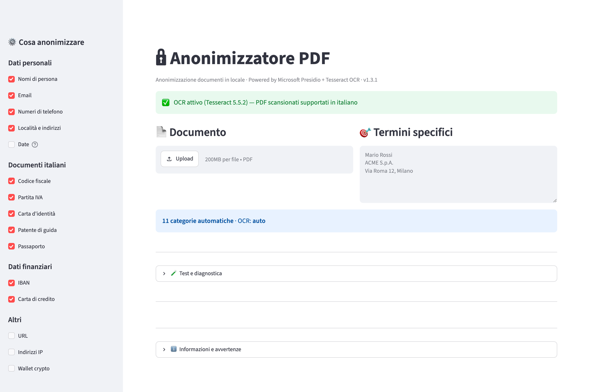

<div align="center">

# 🔒 Anonimizzatore PDF

**Anonimizzazione automatica e GDPR-compliant di documenti PDF per studi legali italiani**

[](https://www.gnu.org/licenses/agpl-3.0)
[](https://www.python.org/downloads/)
[]()
[]()
[]()

[Cosa fa](#-cosa-fa) · [Installazione](#-installazione) · [Uso](#%EF%B8%8F-uso) · [Versioni](#-versioni-disponibili) · [Contribuire](#-contribuire) · [Licenza](#-licenza)

</div>

---

## 🎯 Cosa fa

**Anonimizzatore PDF** rileva e oscura automaticamente i dati sensibili in documenti PDF italiani:

- 👤 **Dati personali** — nomi, email, numeri di telefono, indirizzi
- 🆔 **Documenti italiani** — codice fiscale, P.IVA, carta d'identità, patente, passaporto
- 💳 **Dati finanziari** — IBAN, carte di credito
- 📝 **Termini specifici** — qualsiasi nome, ragione sociale o stringa personalizzata

### Tre vantaggi chiave

1. **🏠 100% locale** — i documenti non escono mai dal computer. Niente cloud, niente API esterne, GDPR-compliant by design.
2. **📄 Funziona anche con PDF scansionati** — OCR integrato (Tesseract) per immagini.
3. **✂️ Redazione vera** — il testo viene fisicamente rimosso dal PDF, non solo coperto da un rettangolo nero. Non recuperabile con copia-incolla.

---

## 📸 Screenshot



---

## 🚀 Installazione

L'app supporta **Windows 10/11** e **macOS 12+** (Intel + Apple Silicon).

### 🪟 Windows

Scarica l'installer pre-compilato dalla pagina [Releases](../../releases):

1. Esegui `AnonimizzatorePDF-Setup.exe`
2. Segui il wizard (10-15 minuti per il primo setup)
3. Doppio click sull'icona Desktop

Oppure compila tu l'installer — vedi [`windows/COMPILA-INSTALLER.md`](windows/COMPILA-INSTALLER.md).

### 🍎 macOS

```bash
git clone https://github.com/jacktotem/anonimizzatore-pdf.git
cd anonimizzatore-pdf/mac
chmod +x installa.sh
./installa.sh
```

Lo script installa automaticamente Homebrew, Python, Tesseract e tutte le dipendenze. Vedi [`mac/README-MAC.md`](mac/README-MAC.md) per i dettagli.

### 🐧 Linux

```bash
sudo apt install python3.12 python3.12-venv tesseract-ocr tesseract-ocr-ita
python3.12 -m venv venv
source venv/bin/activate
pip install -r requirements.txt
python -m spacy download it_core_news_lg
streamlit run src/app.py
```

---

## 🖱️ Uso

1. **Carica un PDF** dal pulsante centrale
2. **Spunta le categorie** di dati da anonimizzare (sidebar a sinistra)
3. **Aggiungi termini specifici** (es. nomi clienti, ragioni sociali) — uno per riga
4. **Modalità OCR**:
   - `Automatica` (consigliata): rileva da solo le pagine scansionate
   - `Forza tutto`: applica OCR a ogni pagina (più lento, più sicuro)
   - `Mai`: solo testo estraibile
5. Clicca **🔒 Anonimizza documento**
6. **Scarica** il PDF risultante

> ⚠️ **Verifica sempre** il PDF risultante prima dell'invio. L'AI può sbagliare.

---

## 🏗️ Architettura

```
┌─────────────────────────────────────────────────────────┐
│                  Frontend (Streamlit)                   │
│                  Browser locale :8501                   │
└─────────────────────────┬───────────────────────────────┘
                          │
            ┌─────────────┴─────────────┐
            │                           │
┌───────────▼────────────┐    ┌─────────▼──────────────┐
│   Estrazione testo     │    │   OCR (se serve)        │
│   PyMuPDF (fitz)       │    │   Tesseract + pytess.   │
└───────────┬────────────┘    └─────────┬──────────────┘
            │                           │
            └─────────────┬─────────────┘
                          │
              ┌───────────▼───────────┐
              │   Microsoft Presidio  │
              │   + spaCy it_core_lg  │
              │   + regex italiane    │
              └───────────┬───────────┘
                          │
              ┌───────────▼───────────┐
              │  Redazione PyMuPDF    │
              │  (rimozione fisica)   │
              └───────────┬───────────┘
                          │
                          ▼
                    📄 PDF anonimo
```

### Stack tecnologico

| Componente | Libreria | Licenza |
|------------|----------|---------|
| UI Web | Streamlit | Apache 2.0 |
| Manipolazione PDF | PyMuPDF (fitz) | AGPL v3 |
| NLP | spaCy + `it_core_news_lg` | MIT |
| Riconoscimento entità | Microsoft Presidio | MIT |
| OCR | Tesseract + pytesseract | Apache 2.0 / MIT |
| Immagini | Pillow | HPND |

### Entità rilevate

**Globali** (Presidio standard):
`PERSON`, `EMAIL_ADDRESS`, `PHONE_NUMBER`, `LOCATION`, `IBAN_CODE`, `CREDIT_CARD`, `IP_ADDRESS`, `URL`, `DATE_TIME`

**Italiane** (Presidio + regex custom):
`IT_FISCAL_CODE`, `IT_VAT_CODE`, `IT_IDENTITY_CARD`, `IT_DRIVER_LICENSE`, `IT_PASSPORT`

---

## 💼 Versioni disponibili

| Tipo | Per chi | Prezzo |
|------|---------|--------|
| **Community** (questo repo) | Sviluppatori, studi che vogliono installarla da soli | Gratis (AGPL v3) |
| **Professional** | Studi che vogliono installazione assistita + supporto | €490 una tantum |
| **Enterprise** | Studi multi-utente con server centrale | €99/mese o €990/anno |

### Cosa include la versione Professional

- ✅ Installazione assistita via TeamViewer/AnyDesk (fino a 3 PC)
- ✅ Configurazione personalizzata sulle vostre esigenze
- ✅ Training di 1 ora per gli avvocati
- ✅ Supporto email 12 mesi
- ✅ Aggiornamenti inclusi per 12 mesi
- ✅ Onboarding documentale dello studio

### Cosa include la versione Enterprise

- ✅ Tutto quello della Professional, più:
- ✅ Hosting su server interno dello studio
- ✅ Gestione utenti multipli con login
- ✅ Audit log completo (chi ha anonimizzato cosa e quando)
- ✅ Supporto prioritario telefonico
- ✅ Aggiornamenti continui
- ✅ SLA garantito

### 📩 Contatti commerciali

**Email**: info@jacoporomani.it
**Sito**: [jacoporomani.it](https://jacoporomani.it)

Richiedi una **demo gratuita** per il tuo studio.

---

## 🤝 Contribuire

Contributi benvenuti! Vedi [CONTRIBUTING.md](CONTRIBUTING.md).

Aree dove c'è bisogno:
- 🐛 **Bug fixing** (vedi [Issues](../../issues))
- 🌐 **Internazionalizzazione** (per ora solo italiano)
- 📚 **Documentazione** (tutorial, esempi, casi d'uso)
- 🎨 **UI/UX** (l'interfaccia Streamlit si può migliorare)
- 🧪 **Test** (suite di test su PDF reali anonimizzati)

---

## ⚖️ Note legali

### Disclaimer

Questo software fornisce uno strumento di assistenza all'anonimizzazione **best-effort**. **L'utente finale (avvocato, studio legale, professionista) è sempre responsabile della verifica finale del documento prima della trasmissione o pubblicazione.**

L'AI può:
- ❌ Mancare entità da anonimizzare (falsi negativi)
- ❌ Anonimizzare entità non necessarie (falsi positivi)
- ❌ Fallire su scansioni di bassa qualità

**Verifica sempre il risultato.**

### GDPR

Il software è progettato per essere GDPR-compliant by design:
- ✅ Elaborazione **completamente locale** (nessun trasferimento dati a terzi)
- ✅ **Niente telemetria** (Streamlit usage stats disabilitato)
- ✅ **Niente persistenza** dei documenti elaborati
- ✅ **Codice sorgente aperto** e verificabile

Vedi [docs/PRIVACY-GDPR.md](docs/PRIVACY-GDPR.md) per il dettaglio.

---

## 📜 Licenza

Questo progetto è distribuito sotto licenza **GNU Affero General Public License v3.0**.

Vedi [LICENSE](LICENSE) per il testo completo.

**In breve:**
- ✅ Puoi usarlo, modificarlo e distribuirlo
- ✅ Puoi usarlo commercialmente (con obblighi)
- ⚠️ Le modifiche devono essere pubblicate sotto la stessa licenza
- ⚠️ Se lo offri come servizio in rete, devi rendere disponibile il codice sorgente agli utenti

Se la AGPL non funziona per il tuo caso d'uso (es. integrazione in software proprietario), [contattami](mailto:info@jacoporomani.it) per una **licenza commerciale alternativa**.

---

## 🙏 Ringraziamenti

Costruito sulle spalle di giganti:

- [Microsoft Presidio](https://github.com/microsoft/presidio) — framework di riconoscimento entità sensibili
- [spaCy](https://spacy.io/) — NLP industriale per Python
- [Streamlit](https://streamlit.io/) — UI web in Python in pochi minuti
- [PyMuPDF](https://github.com/pymupdf/PyMuPDF) — manipolazione PDF rapida e potente
- [Tesseract OCR](https://github.com/tesseract-ocr/tesseract) — OCR storico e affidabile

---

<div align="center">

**Sviluppato in Italia 🇮🇹 con ❤️ per la categoria legale**

[⬆ Torna su](#-anonimizzatore-pdf)

</div>
